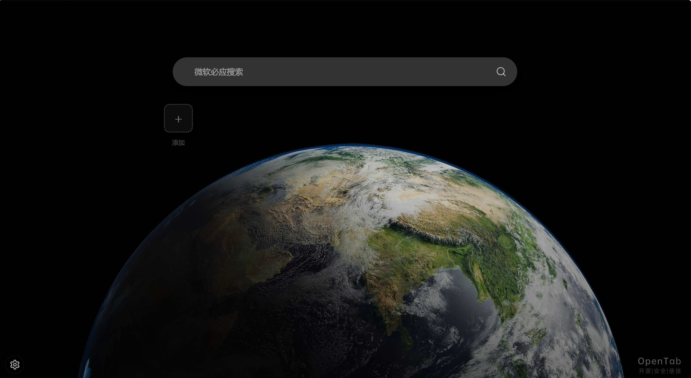

# OpenTab - 本地化新标签页扩展


OpenTab 是一个基于 `Vue 3 + TypeScript + Vite` 开发的浏览器新标签页扩展，面向 Edge/Chrome。项目主打“本地优先”：配置、分类、收藏网站与界面个性化数据均保存在本地，不依赖后端服务。

## 截图




## 功能特性

- 新标签主页
  - 顶部搜索栏，支持 `Bing / Google / Baidu` 与自定义搜索引擎
  - 收藏网站网格展示，支持分类浏览与快速访问
- 快捷圆环
  - 任意网页按住“修饰键 + 鼠标左键”呼出快捷圆环
  - 支持 `Ctrl / Alt / Shift` 触发键
  - 圆环大小可调
  - 最多支持 8 个快捷页面
- 个性化设置
  - 自定义壁纸
  - 图标大小与圆角调节
  - 侧边栏隐藏开关
- 数据导入导出
  - 一键导出配置文件
  - 跨设备导入恢复

## 技术栈

- 框架：`Vue 3`
- 语言：`TypeScript`
- 构建：`Vite`
- 样式：`Tailwind CSS`
- 存储：`chrome.storage.local` + `IndexedDB`

## 本地开发

### 1. 环境要求

- `Node.js >= 18`
- 推荐使用 `pnpm`（也可使用 `npm`）

### 2. 安装依赖

```bash
pnpm install
```

### 3. 本地开发

```bash
pnpm dev 或者 npm run dev
```

## 在浏览器中加载扩展（开发模式）

先执行：

```bash
pnpm build
```

然后加载 `dist` 目录：

### Edge

1. 打开 `edge://extensions/`
2. 开启“开发人员模式”
3. 点击“加载解压缩的扩展”
4. 选择项目的 `dist` 目录

### Chrome

1. 打开 `chrome://extensions/`
2. 开启“开发者模式”
3. 点击“加载已解压的扩展程序”
4. 选择项目的 `dist` 目录

## 打包发布

```bash
pnpm build
```

构建产物位于 `dist/`。

发布方式：

1. 将 `dist/` 下文件打包为 `.zip`，上传到扩展商店。
2. 或在浏览器扩展管理页使用“打包扩展程序”生成 `.crx`（本地分发）。

## 项目结构

```text
openTab/
├─ src/
│  ├─ background/
│  ├─ components/
│  ├─ content/
│  ├─ utils/
│  ├─ views/
│  ├─ manifest.json
│  └─ main.ts
├─ public/
├─ dist/
└─ package.json
```

## 数据与隐私

- 项目不依赖远程后端存储用户配置。
- 主要数据保存在浏览器本地（`chrome.storage.local`）。
- 图片等大对象通过 `IndexedDB` 管理。

## Roadmap

- 支持更多搜索引擎模板与快速导入
- 增强快捷圆环视觉主题配置
- 增加网站批量管理能力

## 贡献指南

欢迎提交 Issue / Pull Request：

1. Fork 本仓库并创建功能分支
2. 提交修改并补充必要说明
3. 发起 PR，描述变更背景与验证方式

## 许可证

`GPL-3.0`
